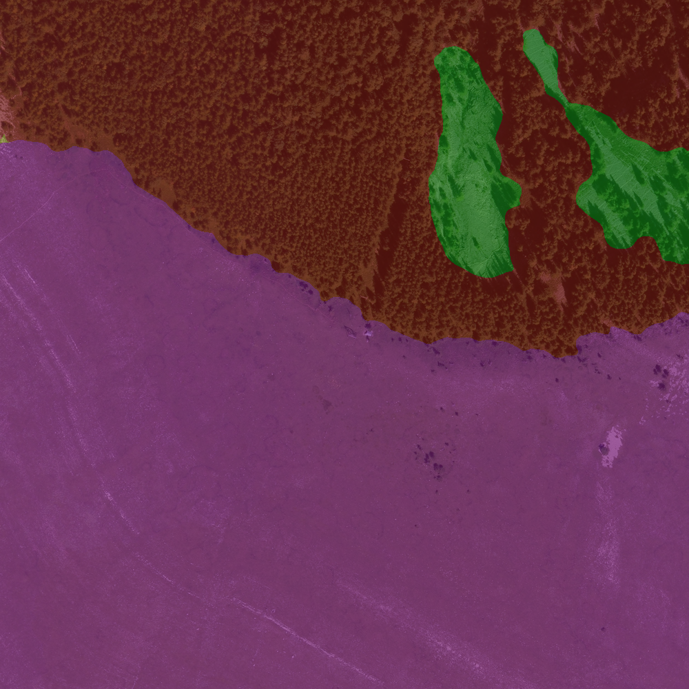
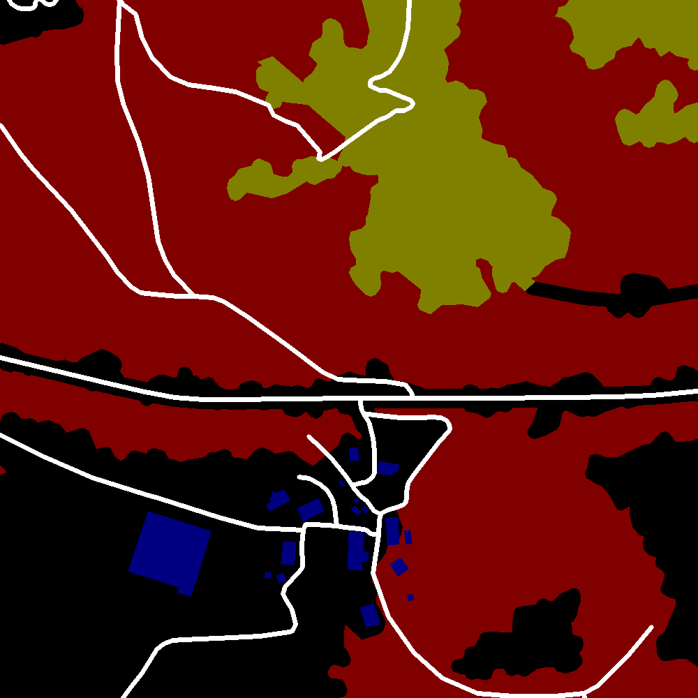
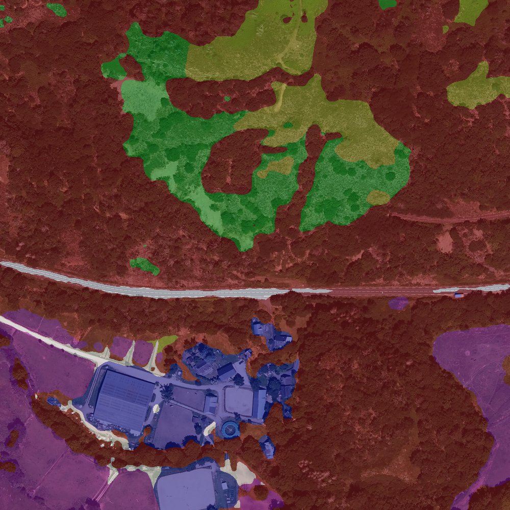
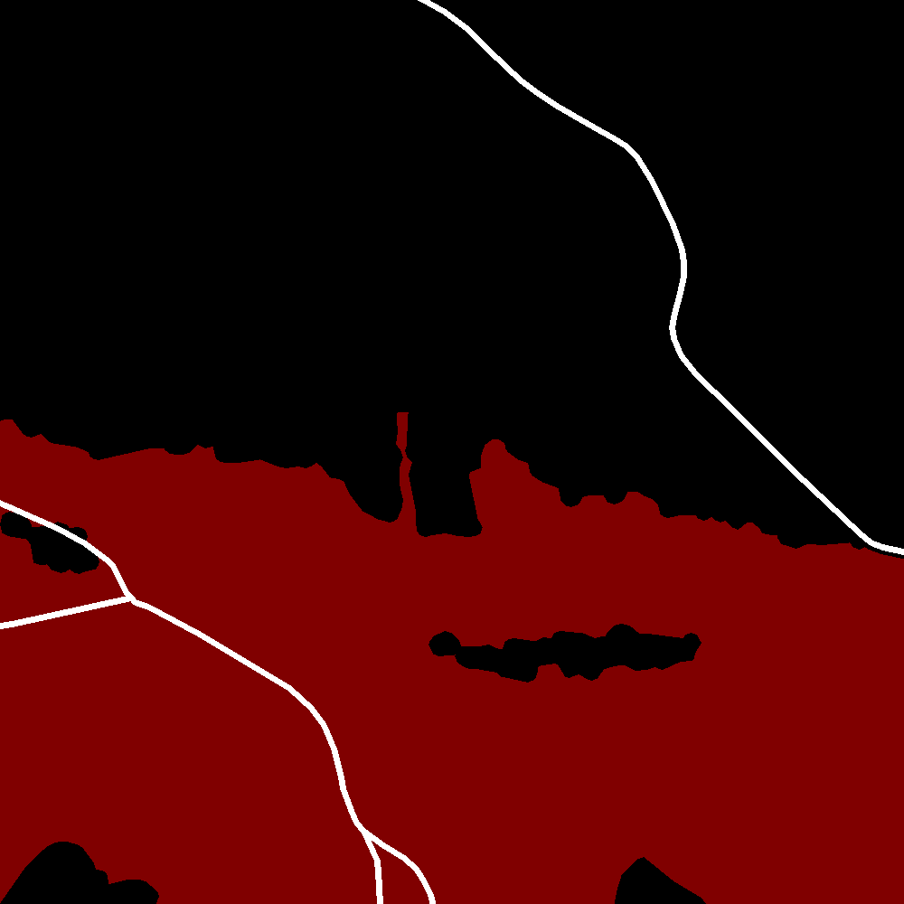
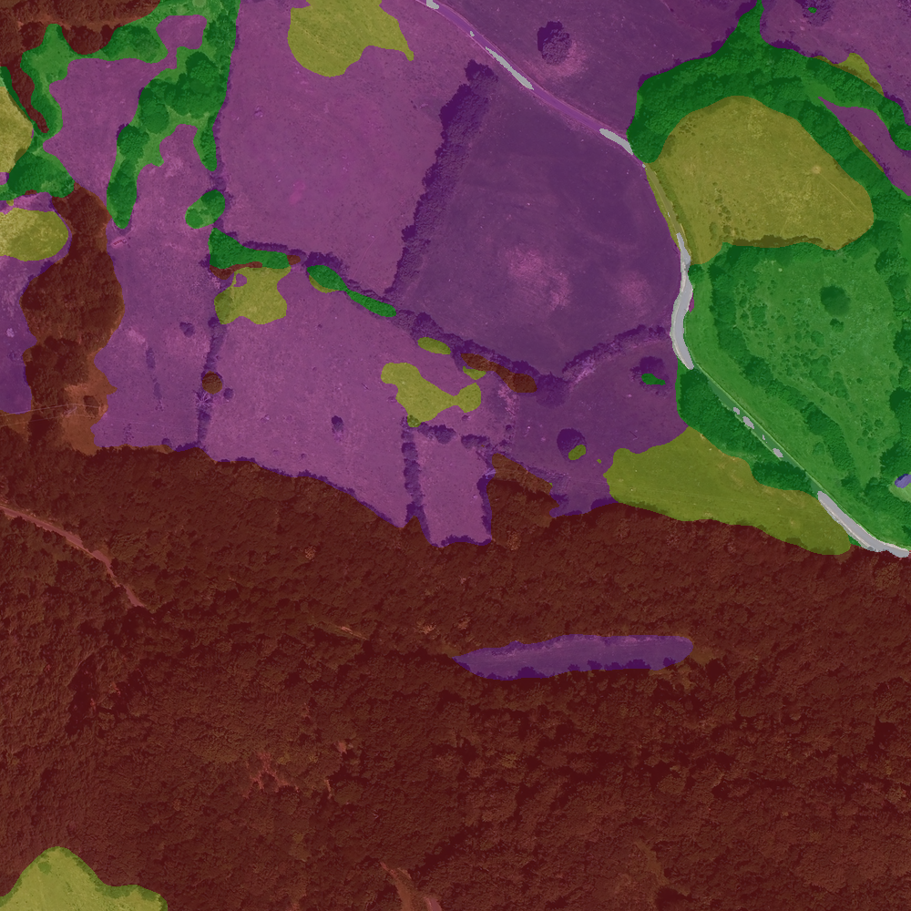
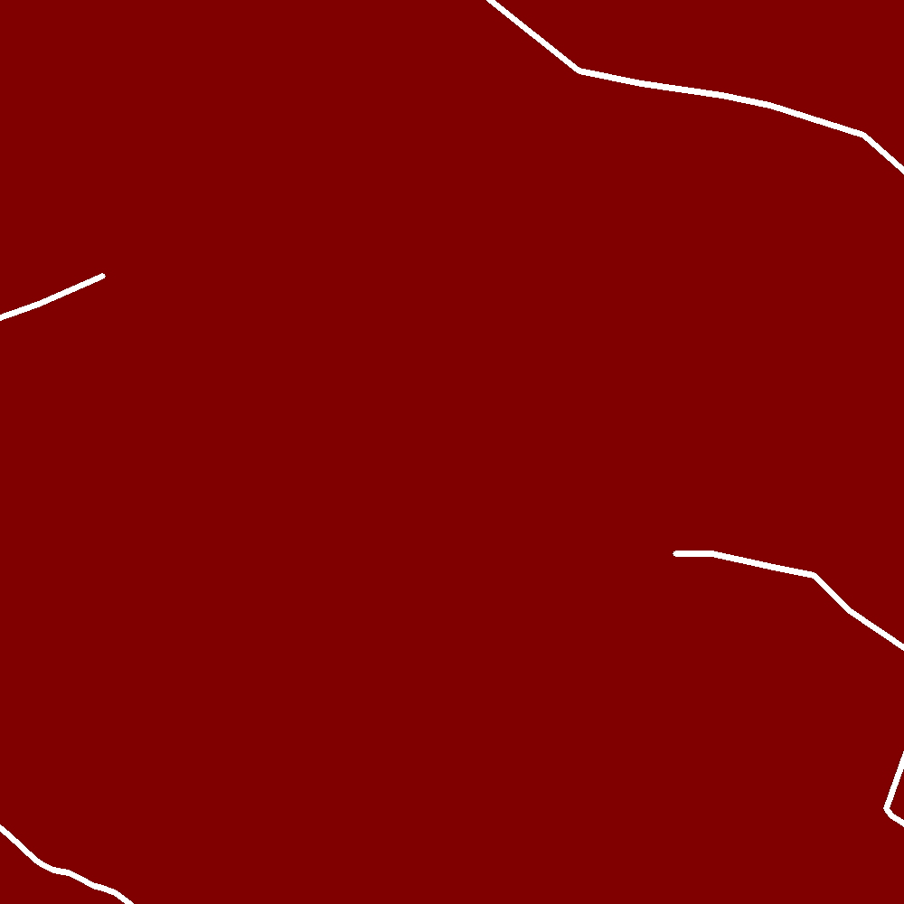
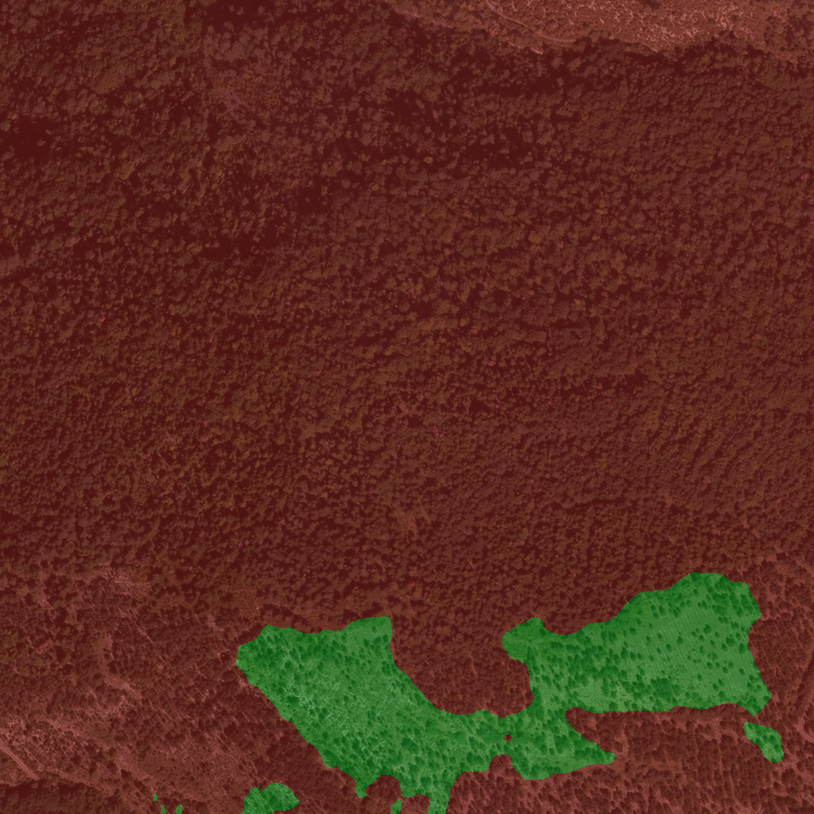

# Swin Transformer for Semantic Segmentation of satellite images

This repo contains the supported code and configuration files to reproduce semantic segmentation results of [Swin Transformer](https://arxiv.org/pdf/2103.14030.pdf). 
It is based on [mmsegmentaion](https://github.com/open-mmlab/mmsegmentation/tree/v0.11.0). In addition, we provide pre-trained models for the semantic segmentation
of satellite images into basic classes (vegetation, buildings, roads).

## Application on the Ampli ANR project

### Goal
This repo was used as part of the [Ampli ANR projet](https://projet.liris.cnrs.fr/ampli/).  

The goal was to do semantic segmentation on satellite photos to precisely identify the species and the density of the trees present in the pictures. However, due to the difficulty of recognizing the exact species of trees in the satellite photos, we decided to reduce the number of classes.  

### Dataset sources
To train and test the model, we used data provided by [IGN](https://geoservices.ign.fr/) which concerns French departments (Hautes-Alpes in our case). The following datasets
have been used to extract the different layers:
* BD Ortho for the satellite images
* BD Foret v2 for vegetation data
* BD Topo for buildings and roads

Important: note that the *data precision is 50cm per pixel.*

Initially, lots of classes were present in the dataset. We reduced the number of classes by merging them and finally retained the following ones:  
* Dense forest
* Sparse forest
* Moor
* Herbaceous formation
* Building
* Road

The purpose of the two last classes is twofold. We first wanted to avoid trapping the training into false segmentation, because buildings and roads were visually present
in the satellite images and were initially assigned a vegetation class. Second, the segmentation is more precise and gives more identification of the different image elements.

### Dataset preparation
Our training and test datasets are composed of tiles prepared from IGN open data. Each tile has a 1000x1000 resolution representing a 500m x 500m footprint (the resolution is 50cm per pixel). 
We mainly used data from the Hautes-Alpes department, and we took spatially spaced data to have as much diversity as possible and to limit the area without information (unfortunately, some places lack information).

The file structure of the dataset is as follows:
```none
├── data
│   ├── ign
│   │   ├── annotations
│   │   │   ├── training
│   │   │   │   ├── xxx.png
│   │   │   │   ├── yyy.png
│   │   │   │   ├── zzz.png
│   │   │   ├── validation
│   │   ├── images
│   │   │   ├── training
│   │   │   │   ├── xxx.png
│   │   │   │   ├── yyy.png
│   │   │   │   ├── zzz.png
│   │   │   ├── validation

```
The dataset is available on download [here](https://drive.google.com/file/d/1y73mUPzS5Hhq1RjPXc9bxch-Nv6HlJem/view?usp=sharing).

### Information on the training
During the training, a ImageNet-22K pretrained model was used (available [here](https://github.com/SwinTransformer/storage/releases/download/v1.0.0/swin_large_patch4_window12_384_22k.pth)) and we added weights on each class because the dataset was not balanced in classes distribution. The weights we have used are:  
* Dense forest => 0.5
* Sparse forest => 1.31237
* Moor => 1.38874
* Herbaceous formation => 1.39761
* Building => 1.5
* Road => 1.47807

### Main results
| Backbone | Method | Crop Size | Lr Schd | mIoU | config | model |
| :---: | :---: | :---: | :---: | :---: | :---: | :---: |
| Swin-L | UPerNet | 384x384 | 60K | 54.22 | [config](configs/swin/config_upernet_swin_large_patch4_window12_384x384_60k_ign.py) | [model](https://drive.google.com/file/d/1EarMOBHx6meawa6izNXJUfXRCTzhKT2M/view) |

Here are some comparison between the original segmentation and the segmentation that has been obtained after the training (Hautes-Alpes dataset):  


| Original segmentation             |  Segmentation after training |
:-------------------------:|:-------------------------:
  |  
  |  
  |  

We have also tested the model on satellite photos from another French department to see if the trained model generalizes to other locations. 
We chose Cantal and here are a few samples of the obtained results:  
| Original segmentation             |  Segmentation after training |
:-------------------------:|:-------------------------:
  |  
  |  
  |  

These latest results show that the model is capable of producing a segmentation even if the photos are located in another department and even if there are a lot of pixels without information (in black), which is encouraging.

### Limitations
As illustrated in the previous images that the results are not perfect. This is caused by the inherent limits of the data used during the training phase. The two main limitations are:  
* The satellite photos and the original segmentation were not made at the same time, so the segmentation is not always accurate. For example, we can see it in the following images: a zone is segmented as "dense forest" even if there are not many trees (that is why the segmentation after training, on the right, classed it as "sparse forest"):  

| Original segmentation             |  Segmentation after training |
:-------------------------:|:-------------------------:
  |  

* Sometimes there are zones without information (represented in black) in the dataset. Fortunately, we can ignore them during the training phase, but we also lose some information, which is a problem: we thus removed the tiles that had more than 50% of unidentified pixels to try to improve the training.

## Usage

### Installation

Please refer to [get_started.md](https://github.com/open-mmlab/mmsegmentation/blob/master/docs/get_started.md#installation) for installation and dataset preparation.

**Notes:** 
During the installation, it is important to:   
* Install MMSegmentation in dev mode:
```
git clone https://github.com/open-mmlab/mmsegmentation.git
cd mmsegmentation
pip install -e .
```
* Copy the *mmcv_custom* and *mmseg* folders into the *mmsegmentation* folder

### Inference
The pre-trained model (i.e. checkpoint file) for satellite image segmentation is available for download [here](https://drive.google.com/file/d/1EarMOBHx6meawa6izNXJUfXRCTzhKT2M/view?usp=sharing).

```
# single-gpu testing
python tools/test.py <CONFIG_FILE> <SEG_CHECKPOINT_FILE> --eval mIoU

# multi-gpu testing
tools/dist_test.sh <CONFIG_FILE> <SEG_CHECKPOINT_FILE> <GPU_NUM> --eval mIoU

# multi-gpu, multi-scale testing
tools/dist_test.sh <CONFIG_FILE> <SEG_CHECKPOINT_FILE> <GPU_NUM> --aug-test --eval mIoU
```

Example on the Ampli ANR project:  
```
# Evaluate checkpoint on a single GPU
python tools/test.py configs/swin/config_upernet_swin_large_patch4_window12_384x384_60k_ign.py checkpoints/ign_60k_swin_large_patch4_window12_384.pth --eval mIoU

# Display segmentation results
python tools/test.py configs/swin/config_upernet_swin_large_patch4_window12_384x384_60k_ign.py checkpoints/ign_60k_swin_large_patch4_window12_384.pth --show
```

### Training

To train with pre-trained models, run:
```
# single-gpu training
python tools/train.py <CONFIG_FILE> --options model.pretrained=<PRETRAIN_MODEL> [model.backbone.use_checkpoint=True] [other optional arguments]

# multi-gpu training
tools/dist_train.sh <CONFIG_FILE> <GPU_NUM> --options model.pretrained=<PRETRAIN_MODEL> [model.backbone.use_checkpoint=True] [other optional arguments] 
```

Example on the Ampli ANR project with the ImageNet-22K pretrained model (available [here](https://github.com/SwinTransformer/storage/releases/download/v1.0.0/swin_large_patch4_window12_384_22k.pth)) :  
```
python tools/train.py configs/swin/config_upernet_swin_large_patch4_window12_384x384_60k_ign.py --options model.pretrained="./model/swin_large_patch4_window12_384_22k.pth"
```

**Notes:** 
- `use_checkpoint` is used to save GPU memory. Please refer to [this page](https://pytorch.org/docs/stable/checkpoint.html) for more details.
- The default learning rate and training schedule is for 8 GPUs and 2 imgs/gpu.


## Citing Swin Transformer
```
@article{liu2021Swin,
  title={Swin Transformer: Hierarchical Vision Transformer using Shifted Windows},
  author={Liu, Ze and Lin, Yutong and Cao, Yue and Hu, Han and Wei, Yixuan and Zhang, Zheng and Lin, Stephen and Guo, Baining},
  journal={arXiv preprint arXiv:2103.14030},
  year={2021}
}
```

## Citing this work 
```
TODO
```

## Other Links

> **Image Classification**: See [Swin Transformer for Image Classification](https://github.com/microsoft/Swin-Transformer).

> **Object Detection**: See [Swin Transformer for Object Detection](https://github.com/SwinTransformer/Swin-Transformer-Object-Detection).

> **Self-Supervised Learning**: See [MoBY with Swin Transformer](https://github.com/SwinTransformer/Transformer-SSL).

> **Video Recognition**, See [Video Swin Transformer](https://github.com/SwinTransformer/Video-Swin-Transformer).
