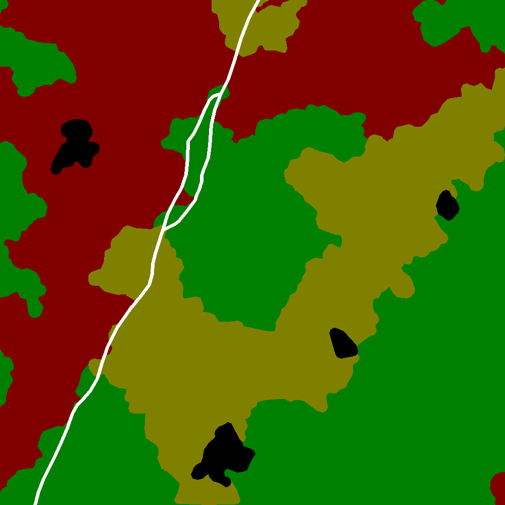
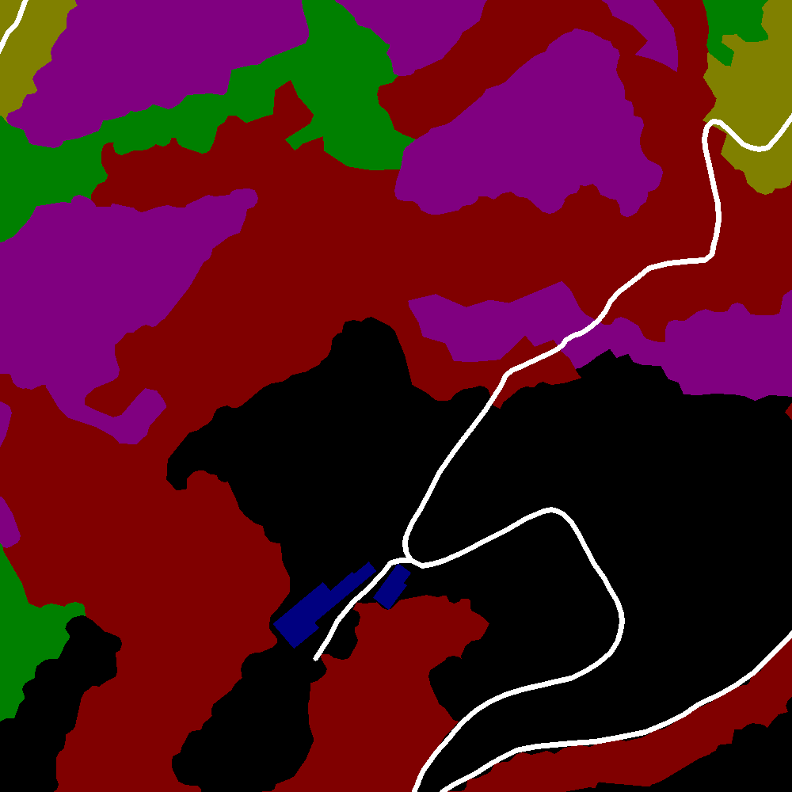
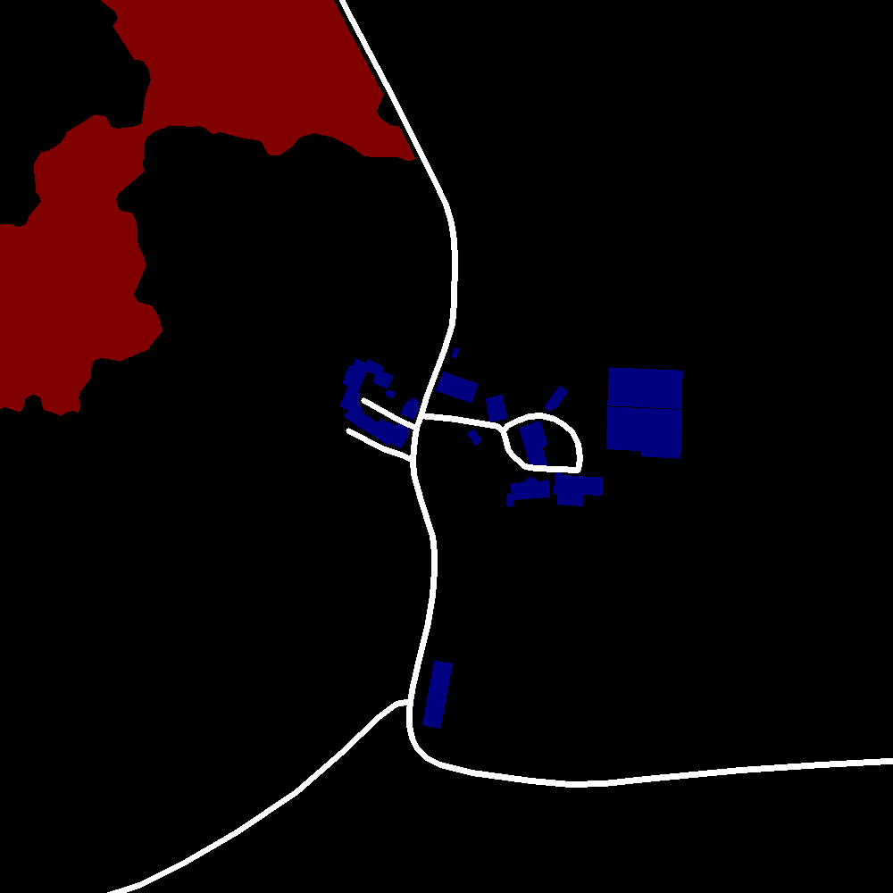
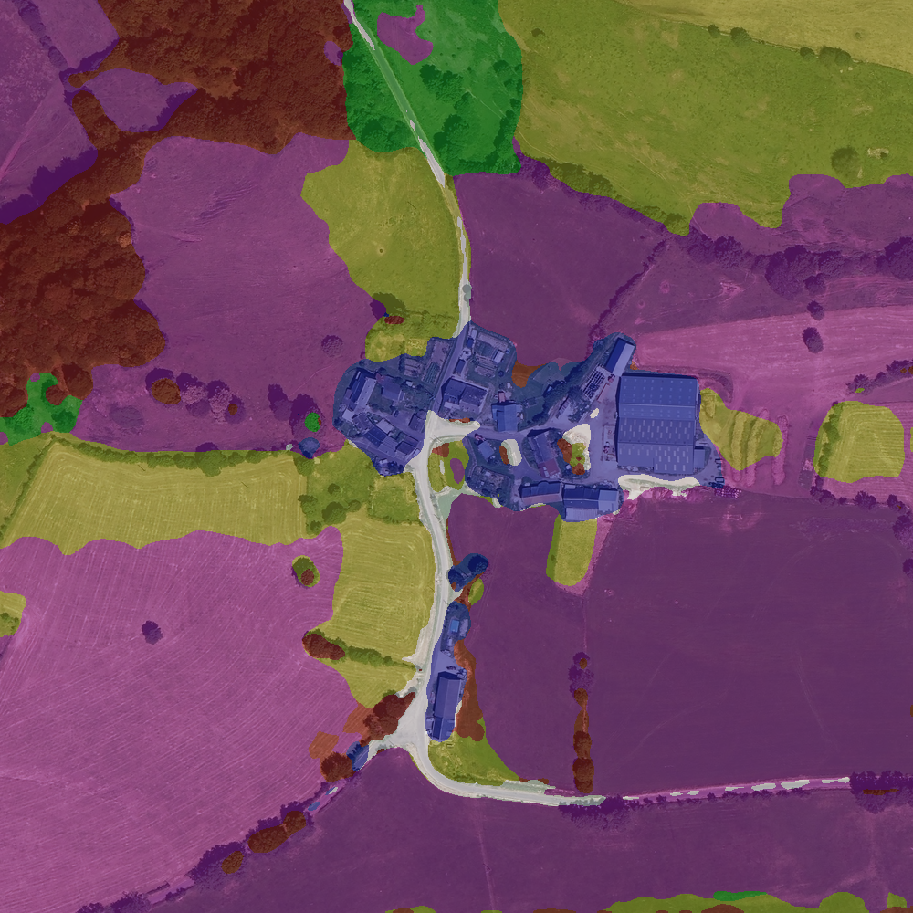

# Swin Transformer for Semantic Segmentaion

This repo contains the supported code and configuration files to reproduce semantic segmentaion results of [Swin Transformer](https://arxiv.org/pdf/2103.14030.pdf). It is based on [mmsegmentaion](https://github.com/open-mmlab/mmsegmentation/tree/v0.11.0).

## Application on the Ampli ANR project

### Goal
This repo was used as part of the [Ampli ANR projet](https://projet.liris.cnrs.fr/ampli/).  

The goal was to do semantic segmentation on satellite photos to precisely identify the species and the density of the trees present on the photos. However, due to the difficulty of recognizing the exact species of trees in the satellite photos, we decided to only learn to identify the density of the trees and forests.  

### Dataset sources
To train and test the model, we used data provided by [IGN](https://geoservices.ign.fr/) which concern French departments (Hautes-Alpes in our case).  

Initially, lots of classes are present in the data, but as said before, we reduce the number of classes (by merging original classes) and finally we have retained the following classes :  
* Dense forest
* Sparse forest
* Moor
* Herbaceous formation
* Building
* Road

As we can see, the last two classes don't refer to forest or tree, however we add them to not distort the training when buildings or roads are visible on satellite photos.

### Dataset preparation
To build our dataset, we have created some tiles from the IGN data. The dimensions of these tiles are 1000x1000 pixels (the resolution is 1 pixel = 50 cm, so it represents an area of 500x500 m). We mainly used data from the Hautes-Alpes department, and we took geographically spaced data to have as much diversity as possible and to limit the area without information (indeed, unfortunately some places lack of information).

The file structure of the dataset is as followed :
```none
├── data
│   ├── ign
│   │   ├── annotations
│   │   │   ├── training
│   │   │   │   ├── xxx.png
│   │   │   │   ├── yyy.png
│   │   │   │   ├── zzz.png
│   │   │   ├── validation
│   │   ├── images
│   │   │   ├── training
│   │   │   │   ├── xxx.png
│   │   │   │   ├── yyy.png
│   │   │   │   ├── zzz.png
│   │   │   ├── validation

```

### Information on the training
During the training, a ImageNet-22K pretrained model was used (available [here](https://github.com/SwinTransformer/storage/releases/download/v1.0.0/swin_large_patch4_window12_384_22k.pth)) and we added weights on each class because the dataset was not balanced in classes distribution. The weights are :  
* Dense forest => 0.5
* Sparse forest => 1.31237
* Moor => 1.38874
* Herbaceous formation => 1.39761
* Building => 1.5
* Road => 1.47807

### Main results
| Backbone | Method | Crop Size | Lr Schd | mIoU | config | model |
| :---: | :---: | :---: | :---: | :---: | :---: | :---: |
| Swin-L | UPerNet | 384x384 | 60K | 54.22 | [config](configs/swin/config_upernet_swin_large_window12_384x384_60k_ign.py) | LIEN CHECKPOINT |

Here are some comparison between the original segmentation and the segmentation that has been obtained after the training (Hautes-Alpes dataset) :  


| Original segmentation             |  Segmentation after training |
:-------------------------:|:-------------------------:
  |  
  |  
  |  

We also tested the model on satellite photos from another French department to see if it could be generalized. We chose Cantal and here are some results :  
| Original segmentation             |  Segmentation after training |
:-------------------------:|:-------------------------:
  |  
  |  
  |  

These latest results show that the model is capable of produce a segmentation even if the photos are located in another department and even if there are a lot of pixels without information (in black), which is encouraging.

### Limitations
We can see in the images shown above that the results are not perfect and it is because there are some imperfection in the data that limit the training. The two main limitations are :  
* The satellite photos and the original segmentation were not made at the same time, so the segmentation is not always accurate. For example, we can see it in the following images : a zone is classed as "dense forest" whereas there are not many trees (that is why the segmentation after training, on the right, classed it as "sparse forest") :  

| Original segmentation             |  Segmentation after training |
:-------------------------:|:-------------------------:
  |  

* Sometimes there are zones without information (represented in black) in the dataset. Fortunately, we can ignore them during the training phase, but we also lose some information, which is a problem : we thus filtered the tiles that had more than 50% of pixels without information to try to improve the training.


## Usage

### Installation

Please refer to [get_started.md](https://github.com/open-mmlab/mmsegmentation/blob/master/docs/get_started.md#installation) for installation and dataset preparation.

### Inference

```
# single-gpu testing
python tools/test.py <CONFIG_FILE> <SEG_CHECKPOINT_FILE> --eval mIoU

# multi-gpu testing
tools/dist_test.sh <CONFIG_FILE> <SEG_CHECKPOINT_FILE> <GPU_NUM> --eval mIoU

# multi-gpu, multi-scale testing
tools/dist_test.sh <CONFIG_FILE> <SEG_CHECKPOINT_FILE> <GPU_NUM> --aug-test --eval mIoU
```

Example on the Ampli ANR project :  
```
# Evaluate checkpoint on a single GPU
python tools/test.py configs/swin/config_upernet_swin_large_patch4_window12_384x384_60k_ign.py checkpoints/ign_60k_swin_large_patch4_window12_384.pth --eval mIoU

# Display segmentation results
python tools/test.py configs/swin/config_upernet_swin_large_patch4_window12_384x384_60k_ign.py checkpoints/ign_60k_swin_large_patch4_window12_384.pth --show
```

### Training

To train with pre-trained models, run:
```
# single-gpu training
python tools/train.py <CONFIG_FILE> --options model.pretrained=<PRETRAIN_MODEL> [model.backbone.use_checkpoint=True] [other optional arguments]

# multi-gpu training
tools/dist_train.sh <CONFIG_FILE> <GPU_NUM> --options model.pretrained=<PRETRAIN_MODEL> [model.backbone.use_checkpoint=True] [other optional arguments] 
```

Example on the Ampli ANR project with the ImageNet-22K pretrained model (available [here](https://github.com/SwinTransformer/storage/releases/download/v1.0.0/swin_large_patch4_window12_384_22k.pth)) :  
```
tools/train.py configs/swin/config_upernet_swin_large_patch4_window12_384x384_60k_ign.py --options model.pretrained="./checkpoints/swin_large_patch4_window12_384_22k.pth"
```

**Notes:** 
- `use_checkpoint` is used to save GPU memory. Please refer to [this page](https://pytorch.org/docs/stable/checkpoint.html) for more details.
- The default learning rate and training schedule is for 8 GPUs and 2 imgs/gpu.


## Citing Swin Transformer
```
@article{liu2021Swin,
  title={Swin Transformer: Hierarchical Vision Transformer using Shifted Windows},
  author={Liu, Ze and Lin, Yutong and Cao, Yue and Hu, Han and Wei, Yixuan and Zhang, Zheng and Lin, Stephen and Guo, Baining},
  journal={arXiv preprint arXiv:2103.14030},
  year={2021}
}
```

## Other Links

> **Image Classification**: See [Swin Transformer for Image Classification](https://github.com/microsoft/Swin-Transformer).

> **Object Detection**: See [Swin Transformer for Object Detection](https://github.com/SwinTransformer/Swin-Transformer-Object-Detection).

> **Self-Supervised Learning**: See [MoBY with Swin Transformer](https://github.com/SwinTransformer/Transformer-SSL).

> **Video Recognition**, See [Video Swin Transformer](https://github.com/SwinTransformer/Video-Swin-Transformer).
